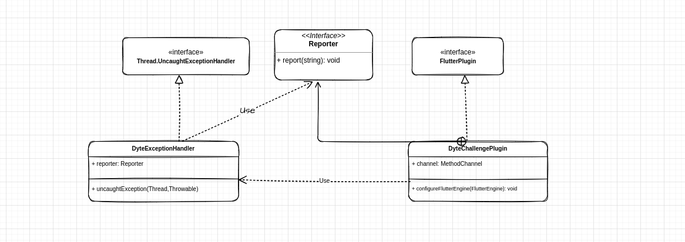
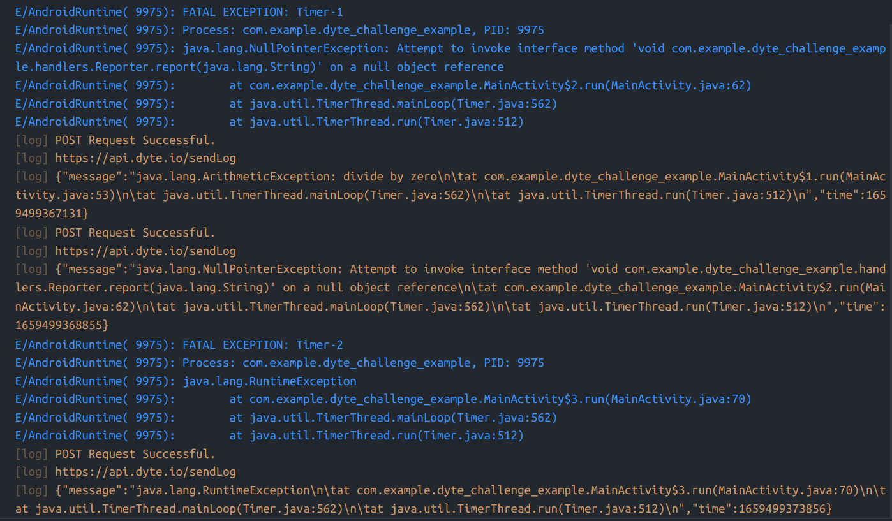

# Dyte Exception Logger

This is challenge-1 I got while applying for internship at Dyte.

## Problem Statement

Develop a Flutter plugin that captures App wide unhandled error and exceptions and makes a POST request to log it to a backend. Don't build a backend for it, assume an HTTP endpoint exists to capture the trace.

## Tech stack

1. Flutter - required
2. Java / Kotlin - required

## Requirements

1. The final output should be a library and not an application

2. Make a flutter plugin that listens for unhandled exception on the native side of the app (platform specific - only Android)

   Note: We want to capture Native exceptions and not flutter errors

3. In case of an Exception the library will send the exception log to a POST route in `json` format

   Trace will look like this (obfuscated in release proguard builds), which tells what the Exception was and the stack trace of where it happened

   ```java
   java.io.IOException: Attempted read from closed stream.
   com.android.music.sync.common.SoftSyncException: java.io.IOException: Attempted read from closed stream.
       at com.android.music.sync.google.MusicSyncAdapter.getChangesFromServerAsDom(MusicSyncAdapter.java:545)
       at com.android.music.sync.google.MusicSyncAdapter.fetchDataFromServer(MusicSyncAdapter.java:488)
       at com.android.music.sync.common.AbstractSyncAdapter.download(AbstractSyncAdapter.java:417)
       at com.android.music.sync.common.AbstractSyncAdapter.innerPerformSync(AbstractSyncAdapter.java:313)
       at com.android.music.sync.common.AbstractSyncAdapter.onPerformLoggedSync(AbstractSyncAdapter.java:243)
       at com.google.android.common.LoggingThreadedSyncAdapter.onPerformSync(LoggingThreadedSyncAdapter.java:33)
       at android.content.AbstractThreadedSyncAdapter$SyncThread.run(AbstractThreadedSyncAdapter.java:164)
   ```


# Solution


## Summary

After reading the problem statement and researching thoroughly this is what I came up with. We have to build a plugin that will listen for all of the unhandled exceptions on android side and will send the `StackTrace` to dart and dart will send it back to server for logging.


## Approach

### Native Side 

On native side to listen to all of the unhandled exceptions there is a method on `Thread ` class `setDefaultUncaughtExceptionHandler(...)` which accepts an implementation of `Thread.UncaughtExceptionHandler`. For this I implemented this interface in the class `DyteExceptionHandler`.  `DyteExceptionHandler` is dependent on an interface `Reporter` which is used to send callbacks to it. 

`DyteExceptionHandler` is set as default exception handler for all unhandled exceptions. It is done in the `DyteChallengePlugin` class. `DyteChallengePlugin` contains a reference to `MethodChannel` which is used to send data to flutter side. It also contains an Inner class `ExceptionReporter` which is an implementation of `Reporter`. This class is used to invoke method channel.

Once any exception is caught, the `uncaughtException(...)` method of `DyteExceptionHandler` class is called. This method creates an `DyteException` by converting `StackTrace` to message and then it calls `report` method of `Reporter`.  While creating the object of `DyteExceptionHandler` the concrete implementation of `Reporter` is injected as `ExceptionReporter`. So this in turns invoke method channel and sends the exception to flutter side.


The diagram below highlights important classes and their interaction.

 


### Flutter side

On receiving a call from native side we call a static method `sendDataToServer` with the arguments received in the `ExceptionLoggerFacade` . `ExceptionLoggerFacade` initialises all the objects and calls the `LogExceptionRepository.sendDataToServer(DyteException)` by converting the message received into an instance of `DyteException`. 

As per the requirements we have to send a POST request. To mock that I have made a `MockHttpService` which can do `GET` and `POST` requests. This class simply logs the output to console and returns a mock `Response`.

This is the logging it does: 




## Usage

To use this plugin, simply include this in the `pubspec.yaml` file

```yaml
dyte_challenge:
  git: 
    url: https://github.com/thisisamank/dyte_exception_plugin
```

Initialise the plugin using `DyteExceptionLogger.init()`

### Demo App

Run the demo app by doing `flutter run`. The native example app contains `Timer`s which are used to raise exceptions on subsequent basis.